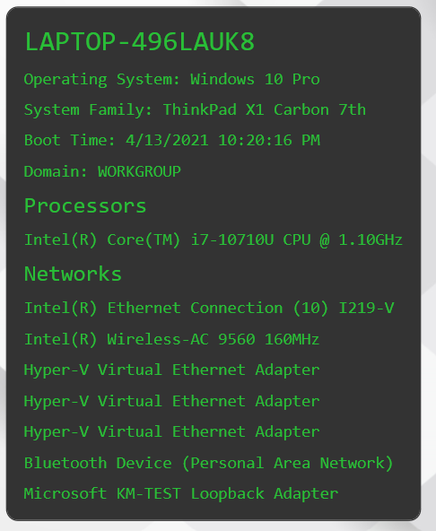
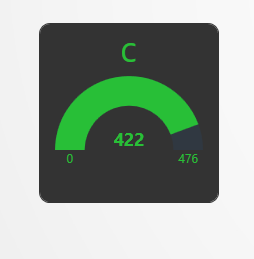
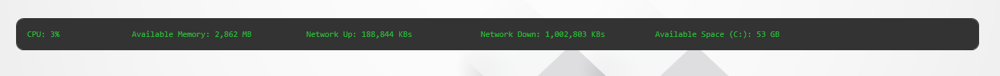
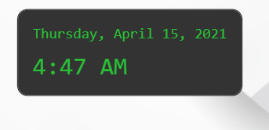

# PSCommander Extensions


Command your desktop with PowerShell

# Install PSCommander

PSCommander is a PowerShell module you can install.

```powershell
Install-Module PSCommander
Start-PSCommander
```

# Configure PSCommander

PSCommander is configured with a single config.ps1 file. 

```powershell
mkdir "$env:USERPROFILE\Documents\PSCommander"
code "$env:USERPROFILE\Documents\PSCommander\config.ps1"
```

[View the docs](https://docs.poshtools.com/powershell-pro-tools-documentation/pscommander) for more information.

# About this Repository

This repository contains extensions for PSCommander. You can install this module with `Install-Module`

```powershell
Install-Module PSCommander.Extensions
```

For issues related to PSCommander itself, file them on our [central product repository](https://github.com/ironmansoftware/issues).

# Widgets

Display widgets on your desktop. They will update automatically and will be positioned on top of your wallpaper but under your icons. 

## Computer Info

Displays computer info

```powershell
New-CommanderComputerInfo
```



## Drive Space 

Display a drive space widget as a gauge. 

```powershell
New-CommanderDriveSpaceGauge -DriveLetter C
```



## Simple Performance Information 

Display a simple performance desktop widget.

```powershell
New-CommanderSimplePerformanceInfo
```



## Time and Date 

Displays time and date. 

```powershell
New-CommanderTimeAndDate
```

